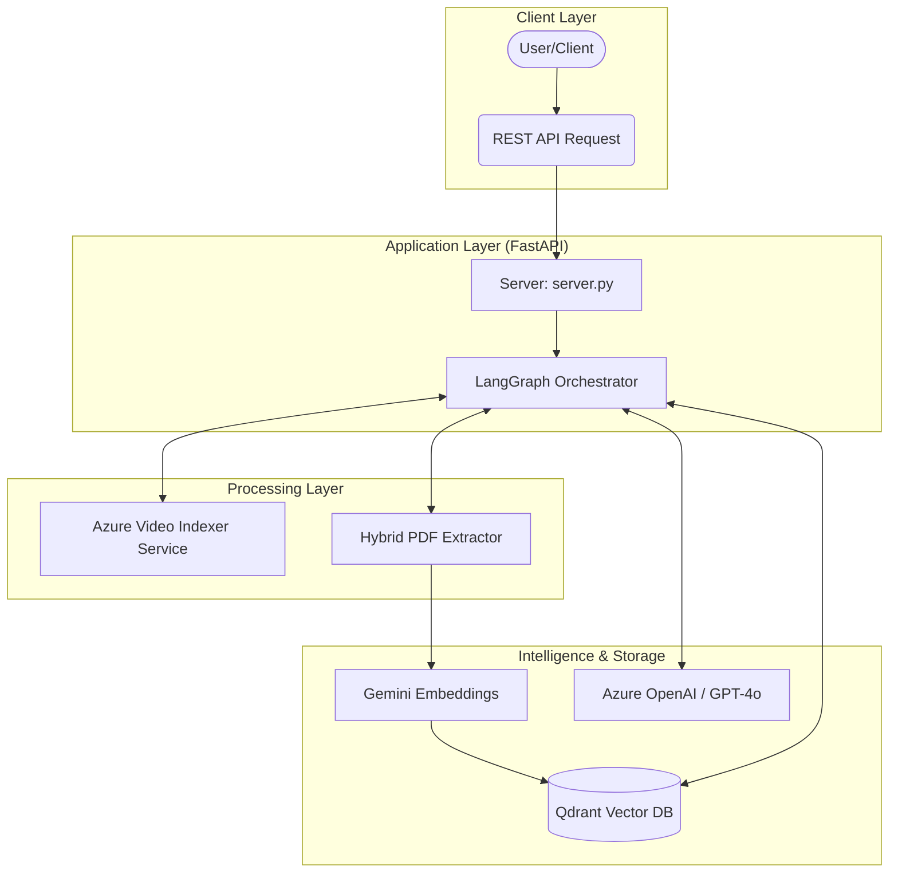
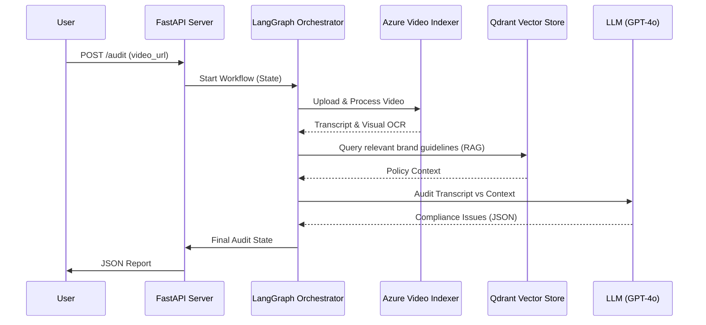

# Technical System Architecture - Multimodal LLMOps

This document provides a detailed technical overview of the `Multimodal LLMOps` system architecture, data flows, and component interactions.

---

## 1. High-Level System Architecture

The system follows a modular, layer-based architecture designed for multimodal data processing and LLM-driven compliance auditing.



---

## 2. Component Diagram

Each functional component is isolated to ensure maintainability and scalability.

```mermaid
classDiagram
    class Server {
        +POST /audit(video_url)
        +GET /health()
    }
    class Workflow {
        +State: VideoAuditState
        +Nodes: index_vid, audit_audio, screen_visual
    }
    class VideoIndexer {
        +download_youtube()
        +upload_to_azure()
        +wait_for_processing()
        +extract_insights()
    }
    class DocumentProcessor {
        +extract_digital_text()
        +extract_image_ocr()
        +generate_chunks()
    }
    class VectorStore {
        +upsert_documents()
        +similarity_search()
    }

    Server --> Workflow : triggers
    Workflow --> VideoIndexer : "Node: Index Video"
    Workflow --> VectorStore : "Node: Audio Auditor"
    DocumentProcessor --> VectorStore : "Indexing Script"
```

---

## 3. Data Flow Pipeline (Audit Workflow)

The sequence of operations during a compliance audit request.



---

## 4. Technology Stack Summary

- **Orchestration**: LangGraph (State Machine).
- **LLM / Reasoning**: Azure OpenAI GPT-4o.
- **Embeddings**: Google Gemini (`embedding-001`).
- **Vector DB**: Qdrant.
- **OCR Engine**: PaddleOCR (v5).
- **PDF Parser**: PyMuPDF (fitz).
- **Backend Framework**: FastAPI.
- **Dependency Management**: uv.
