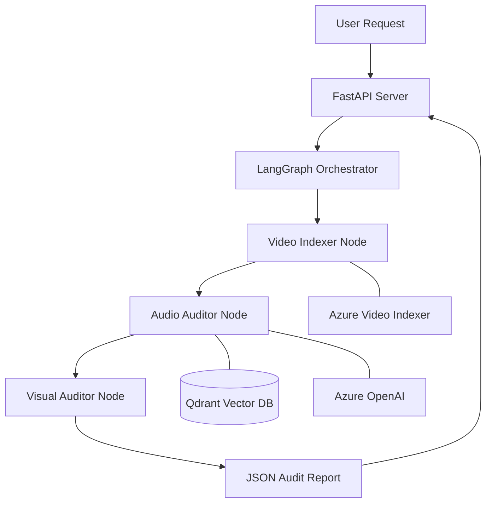
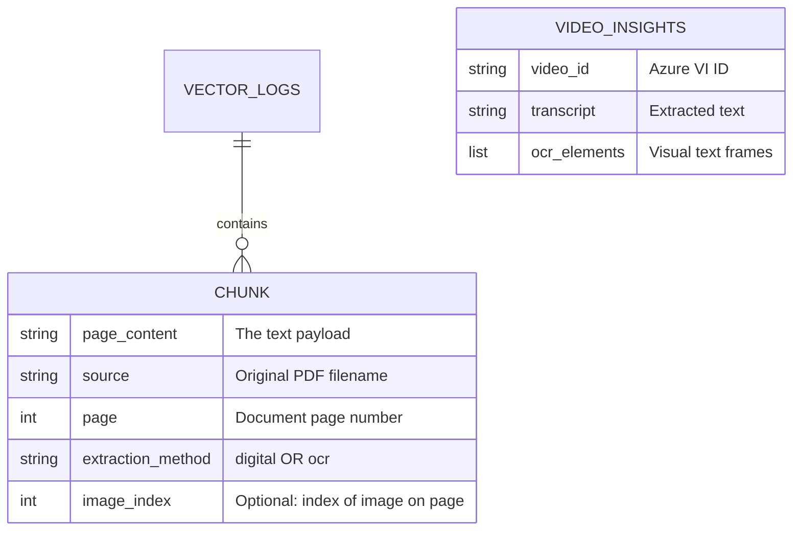

# Multimodal LLMOps - Project Documentation

## 1. Project Overview

`Multimodal LLMOps` is a Python-based platform for auditing video content (e.g., advertisements, brand videos) against compliance and policy requirements. It leverages multimodal inputs (audio, visual text, and reference documents) to provide structured reports.

---

## 2. Tools & Technologies

### 2.1 AI & Orchestration
| Tool | Purpose |
| :--- | :--- |
| **LangGraph** | Workflow orchestration and state management via directed graphs. |
| **LangChain** | Framework for developing LLM applications and vector store integrations. |
| **Qdrant** | High-performance vector database for storing and retrieving semantic information. |
| **PaddleOCR** | Deep learning-based OCR for extracting text from images within PDFs. |
| **PyMuPDF (fitz)** | Efficient parsing of the digital text layer in PDF documents. |
| **Gemini Embeddings** | Vectorization of content using `models/embedding-001`. |
| **Azure OpenAI** | Provides LLM capabilities (GPT-4o) for complex compliance reasoning. |

### 2.2 Cloud & Infrastructure
| Tool | Purpose |
| :--- | :--- |
| **Azure Video Indexer** | Extraction of multi-channel insights (transcription, keywords, visual OCR). |
| **FastAPI** | High-performance web framework for the backend API. |
| **uv** | Modern Python package management, dependency resolution, and virtual environments. |
| **Azure CLI** | Authentication and management of cloud resources. |

---

## 3. Methodologies

### 3.1 Hybrid PDF Extraction
To ensure 100% data coverage of brand guidelines, the system uses a dual-engine approach:
1.  **Digital Layer**: `PyMuPDF` extracts searchable text quickly and accurately.
2.  **Image Layer**: `PaddleOCR` scans every image embedded in the PDF to capture text that is otherwise invisible to standard parsers.

### 3.2 Retrieval-Augmented Generation (RAG)
Relevant brand policies are chunked and stored in **Qdrant**. During the audit:
-   The video transcript is used as a query.
-   Qdrant returns the most relevant policy snippets.
-   The LLM audits the video content specifically against these retrieved rules.

### 3.3 State-Based Orchestration
The pipeline is designed as a **LangGraph State Machine**. This allows for:
-   **Granular Error Handling**: If transcription fails, the audit node skips gracefully.
-   **Persistent State**: Every step of the audit is logged in the `VideoAuditState` object.

---

## 4. Project Architecture

The following diagram illustrates the data flow from video ingestion to the final compliance report.



---

## 5. Storage Schema (ER Diagram)

While the project primarily uses unstructured video data, the knowledge base stored in Qdrant follows a specific metadata structure.



---

## 6. Project Structure

-   `backend/scripts/index_document.py`: Refines brand guidelines and populates Qdrant.
-   `backend/src/graph/nodes.py`: Contains the logic for each step of the audit.
-   `backend/src/graph/state.py`: Defines the data schema for the workflow state.
-   `backend/src/api/server.py`: Entry point for the FastAPI service.
-   `backend/data/`: Repository for brand guideline PDFs.

---

## 7. Setup and Usage

### 7.1 Environment Setup
1.  Install `uv`.
2.  Run `uv sync`.
3.  Configure `.env` with API keys for Gemini, Azure OpenAI, Qdrant, and Video Indexer.

### 7.2 Running the Pipeline
```bash
# Index Guidelines
uv run python backend/scripts/index_document.py

# Start Server
uv run python -m backend.src.api.server
```
